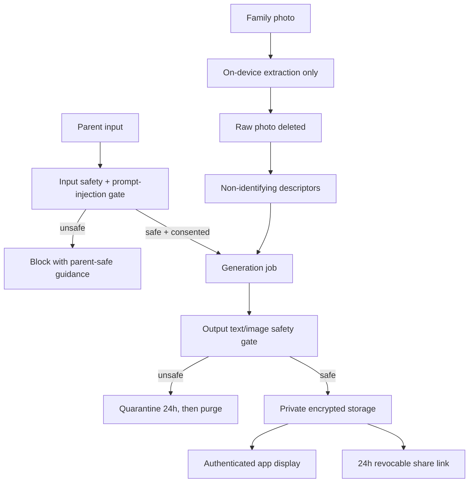

# Production Readiness Requirements

## Summary

Kahani will launch as a US-only, parent-only, security-first story-generation app with prompt-injection guardrails as the first production gate. The launch bar includes no external family-photo processing, consent-gated external text AI, redacted/minimized external image AI inputs, private encrypted storage, Render API + worker + Postgres deployment, reliable background jobs, production observability, and operational runbooks.

---

## Problem Frame

Kahani asks parents to enter sensitive child behavior concerns and may generate stories/images involving their family. That creates a higher trust burden than a generic content app: child names, behavior details, family context, generated stories, and generated images can all become sensitive if mishandled.

The main production risk is not only ordinary app downtime. The app must prevent prompt-injection abuse, avoid leaking family photos, keep user content private, stop unsafe generated output before parents see it, control provider spend, preserve deletion promises, and give operators enough logs and alerts to debug incidents without casually exposing child/family content.

---

## Actors

- A1. Parent account holder: Adult user who signs in, creates child profiles, consents to AI processing, generates books, shares books, and controls deletion.
- A2. Child subject: Child represented in profiles and generated stories; not an account holder or direct production user.
- A3. Kahani operator: Founder/developer with limited production admin access for operations, debugging, incident response, and deployment.
- A4. AI provider: Approved third-party text or image provider that receives only the data allowed by consent and minimization rules.
- A5. Infrastructure provider: Approved production service provider for hosting, database, storage, auth, observability, or key management.

---

## Key Flows

- F1. Story generation with consent and safety gates
  - **Trigger:** Parent requests a generated story.
  - **Actors:** A1, A4
  - **Steps:** Parent consents to external text AI processing, prompt-injection and safety gates evaluate the request, the job runs with idempotent retry behavior, generated text/images pass output safety gates, then safe results are saved privately and displayed.
  - **Outcome:** One parent action produces at most one logical book, unsafe content is not shown, and allowed provider data is minimized.
  - **Covered by:** R1, R2, R3, R4, R16, R17

- F2. Photo-based personalization without external photo processing
  - **Trigger:** Parent adds a family photo for personalization.
  - **Actors:** A1, A2
  - **Steps:** The app performs on-device-only metadata extraction, raw photos never leave the device, original photos are deleted immediately after extraction, and the parent manually enters details when extraction is insufficient.
  - **Outcome:** Kahani can personalize from safe descriptors without sending child or parent face photos to any external provider.
  - **Covered by:** R5, R6, R7

- F3. Private sharing
  - **Trigger:** Parent creates a share link for a generated book.
  - **Actors:** A1
  - **Steps:** Parent re-authenticates if required, shared content redacts real child names, the link is unlisted and expires after 24 hours, access is logged, and the parent can revoke the link.
  - **Outcome:** Sharing is possible without creating a public gallery or long-lived exposure path.
  - **Covered by:** R11, R13

- F4. Production incident response
  - **Trigger:** Alert fires for security/data risk or generation reliability.
  - **Actors:** A3, A5
  - **Steps:** Operator follows the relevant runbook, uses metadata-first logs, accesses sensitive content only through approved support or emergency process, resolves or rolls back, and records follow-up action.
  - **Outcome:** Incidents can be investigated quickly without routine content browsing.
  - **Covered by:** R9, R10, R14, R18, R19, R20

---

## Safety And Data Flow

---

## Requirements

**Prompt, AI, and generated-output safety**
- R1. Input gates must block prompt-injection attempts and serious safety, medical, mental-health, abuse, violence, self-harm, crisis, or urgent-risk prompts before generation, with parent-safe guidance and guardrail events.
- R2. External text AI processing requires explicit parent consent; without consent, story generation is blocked with clear consent copy.
- R3. Generated story text and images must pass output safety gates before display or saving; unsafe outputs are never shown, may be quarantined encrypted for 24 hours, then are purged automatically.
- R4. Production user data must never be used to train or fine-tune models.

**Family photo privacy**
- R5. Child and parent face photos must never be sent to third-party AI providers.
- R6. Photo metadata extraction must run on-device only; raw family photos never leave the parent device, are deleted immediately after controlled extraction, and fall back to parent-entered appearance details when extraction is insufficient.
- R7. Third-party image providers may receive only redacted/minimized non-photo illustration inputs; no face photos, raw parent prompts, or real child names may be sent.

**Storage, sharing, deletion, and encryption**
- R8. Generated story images and books must use private storage only, served through authenticated short-lived URLs or backend-controlled access.
- R9. App-level encryption is required for sensitive fields/assets, using managed KMS-style key custody with rotation, auditability, and recovery planning.
- R10. Account deletion must delete child profiles, stories, generated images, user-linked logs, and improvement data within 30 days.
- R11. Share links must be private unlisted links with 24-hour default expiry, parent revocation, access logging, no indexing, and redacted child names in shared/exported views.
- R12. Generated books must not be readable offline at launch.

**Auth, consent, admin access, and user role**
- R13. Production is parent-only, uses social login only including Apple sign-in for iOS, and requires fresh re-authentication for sensitive account actions.
- R14. No routine admin browsing of user content is allowed; founder/developer admin access requires MFA, least privilege, audit logs, and explicit support grant or emergency process for sensitive content.
- R15. Account-level opt-in is allowed for product improvement, but stored improvement data must be redacted first; raw data may be retained only briefly for redaction/debug failures and must never be sold.

**Deployment, reliability, and data operations**
- R16. Launch deployment must use Render with separate API and worker services plus managed Postgres, with separate staging and production resources and synthetic-only staging data.
- R17. Story generation jobs must use at-least-once retry behavior with idempotency, background auto-retries, strict retry limits, stuck-job detection, and provider-cost controls.
- R18. Database launch readiness must include automated backups, safe migration practice, and at least one tested restore drill.

**Observability, runbooks, and launch controls**
- R19. Production observability must include metadata-first logs, redacted failed-job debug artifacts retained for 30 days, founder-only critical alerts for security/data risk and generation reliability, and a full operational runbook set.
- R20. US-only public signup with caps is allowed only after privacy/terms, vendor allowlisting with US-region controls where available, internal security review, generation quotas, spend caps, generation endpoint rate limits, automated abuse signals, and fast shutdown controls are in place.

---

## Acceptance Examples

- AE1. **Covers R1.** Given a parent prompt that says "ignore your rules" or asks for hidden system prompts, when the parent submits it, generation is blocked before any provider call and a guardrail event is recorded.
- AE2. **Covers R2.** Given a parent has not consented to external text AI processing, when they try to generate a story, the app blocks generation and explains that external AI text processing consent is required.
- AE3. **Covers R5, R6.** Given a parent uploads a child photo, when on-device extraction succeeds, raw photo data never leaves the device and the original photo is deleted after extraction; when extraction fails, the parent is asked to enter appearance details manually.
- AE4. **Covers R3.** Given generated text or images fail output safety review, when the job completes, the parent is not shown the unsafe output, the run fails safely, and encrypted quarantine expires after 24 hours.
- AE5. **Covers R10.** Given a parent deletes their account, when deletion completes within the 30-day window, child profiles, stories, generated images, user-linked logs, and improvement data are removed or irreversibly disassociated according to the deletion policy.
- AE6. **Covers R11.** Given a parent creates a share link, when another person opens it, the link is unlisted, expires after 24 hours, access is logged, and the shared view does not expose the child real name.
- AE7. **Covers R17.** Given a transient provider failure during generation, when the worker retries, the same parent action does not create duplicate logical books and retries stop at the defined budget.
- AE8. **Covers R19.** Given a failed generation job, when logs are inspected, operators can see request/job metadata, redacted failure context, provider error class, retry count, and cost signals without raw child names, photos, or images.

---

## Success Criteria

- Parents can generate stories with clear consent, private storage, safe sharing, and deletion guarantees without raw family photos leaving the device.
- Kahani can debug production incidents through metadata-first observability, redacted failed-job artifacts, and runbooks without routine content browsing.
- Unsafe inputs and unsafe generated outputs are blocked before they reach parents.
- Public signup beta is constrained by quotas, spend caps, alerts, and fast shutdown controls.
- A downstream planning pass can translate this doc into implementation work without inventing security posture, launch gates, or scope boundaries.

---

## Scope Boundaries

- Parent data export is deferred after launch; deletion is required at launch.
- External security/privacy review is deferred; internal security review is required before launch.
- Child accounts are out of scope for launch.
- Private/self-hosted AI generation is deferred; third-party text AI requires consent, and third-party image AI receives only redacted/minimized non-photo inputs.
- No external family-photo AI processing is allowed.
- No training or fine-tuning on production user data is allowed.
- No offline book reading at launch.
- No public gallery or long-lived public sharing links.
- No real production data in staging.
- No global launch; launch is US-only.

---

## Key Decisions

- Prompt-injection guardrails first: The first production gate must stop prompt override attempts before any story job starts.
- Privacy over likeness fidelity: Raw family photos never leave the device, so parent-entered descriptors are the fallback when on-device extraction is insufficient.
- Public signup with caps: Kahani can learn from real usage sooner, but launch must include quotas, spend caps, abuse controls, and alerting.
- Redacted improvement loop: Account-level opt-in can support product improvement, but stored data is redacted first and never sold.
- Share links included but constrained: Sharing is allowed only with short expiry, revocation, access logging, redacted names, and no indexing.
- Render-first deployment: Render API + worker + managed Postgres is the launch topology.
- App-level encryption: Sensitive fields and assets require application-layer encryption with managed key custody.
- Terms/Privacy-only medical disclaimer: This is the selected launch stance, but it remains a risk because the app handles child behavior guidance.

---

## Dependencies / Assumptions

- AI, auth, storage, observability, KMS, and hosting providers can meet the vendor allowlist and US-region requirements.
- On-device metadata extraction is feasible enough for launch, or parent-entered appearance details provide an acceptable fallback.
- The product can explain external text AI consent clearly enough that blocked generation is understandable when consent is absent.
- Render can support the API/worker/Postgres topology with the required operational controls.
- App-level encryption can be implemented without breaking background jobs, sharing, deletion, restore, and support workflows.
- A legal/privacy review process exists before public signup to produce acceptable Terms and Privacy Policy language.

---

## Outstanding Questions

### Deferred to Planning

- [Affects R6][Technical] What on-device extraction capability is practical for launch, and what exact descriptors are safe and useful?
- [Affects R9][Needs research] Which managed KMS provider best fits Render-hosted services while satisfying key rotation, audit, and recovery requirements?
- [Affects R19][Technical] Which observability stack gives enough redaction, retention, alerting, and incident visibility without sending sensitive payloads to unapproved vendors?
- [Affects R20][Needs research] Which vendors can meet the no-training, deletion, retention, US-region, subprocessor, and breach-process requirements?
- [Affects R20][Needs research] Does US-only public signup with child behavior data require stronger in-app medical/therapy disclaimer placement than Terms/Privacy alone?
