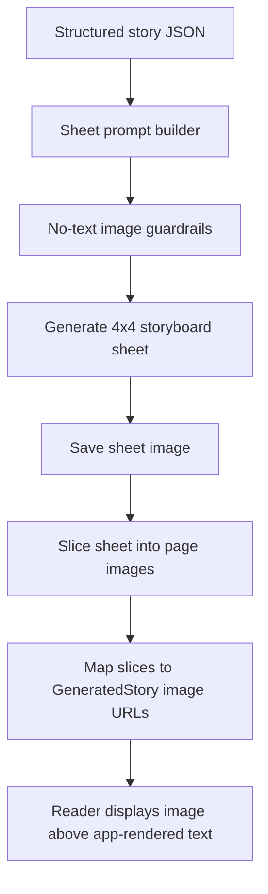

# Image Generation Spec

## Goal

Improve generated book illustrations so they support the story without competing with the reader UI.

This spec covers:

- text-free generated illustrations
- storyboard sheet prompt guardrails
- image artifacts expected by the reader

Story generation requirements live in `docs/story-generation-spec.md`.

## Source Feedback

Key feedback:

- Generated images sometimes include visible text.
- Text inside illustrations breaks the storybook experience.
- Users should read story text from the app UI, not from generated images.

## Current Image Flow

1. Story generation produces structured story JSON.
2. The sheet prompt injects that JSON into `sheet-master-prompt.txt`.
3. Image generation creates one 4x4 storyboard sheet.
4. Python slices the sheet into cover, story pages, end page, and supporting panels.
5. The app uses sliced image URLs in the book reader.

## Required Behavior

### 1. Text-Free Illustrations

Generated images must contain no readable text anywhere.

Do not render:

- book title
- `This book belongs to`
- `The End`
- story text
- captions
- page numbers
- signs
- labels
- speech bubbles
- handwriting
- pseudo-text or gibberish text

All readable story text must come from structured story data and render in the app UI below the illustration.

### 2. Illustration-Only Cover And End Panels

Cover and end panels should be illustration-only.

Expected:

- cover panel visually evokes the title and emotional premise
- ownership/opening panel is a warm child-centered illustration, not a text page
- end panel is a peaceful closing illustration, not a rendered "The End" card

### 3. Story Page Image Inputs

Each story page image should use:

- `scene` for physical action and setting
- `composition` for camera framing
- `emotion` for posture and facial expression

The image model should not use page `text` as text to render. Page text may inform emotion and action, but must not appear inside the image.

## Proposed Architecture

## Implementation Plan

### Phase 1: Prompt Guardrails

Keep `sheet-master-prompt.txt` strict:

- no text anywhere in the image
- no title text
- no end-page text
- no labels, signs, captions, or speech bubbles
- no pseudo-text or gibberish marks

### Phase 2: Visual QA

Add a repeatable QA checklist for generated sheets:

- inspect cover panel for text
- inspect end panel for text
- inspect story pages for labels/signs/speech bubbles
- inspect sliced pages in reader view

### Phase 3: Future Automated Detection

Consider adding OCR-based checks later.

Possible behavior:

- run OCR on generated sheet or slices
- flag runs with detected text
- optionally retry image generation with stronger no-text prompt

## Acceptance Criteria

### Text-Free Sheet

Given any generated storyboard sheet:

- no readable text appears in any panel
- no pseudo-readable text appears in any panel
- cover and end panels are illustration-only

### Reader Ownership Of Text

Given a completed book:

- story text appears only in the app-rendered reader text area
- illustrations do not contain story text
- users are never expected to read text embedded in images

### Prompt Regression

`sheet-master-prompt.txt` must continue to include:

- a critical no-text rule
- negative prompt terms for text, typography, handwriting, pseudo-text, signs, labels, captions, speech bubbles, and page numbers

## Open Questions

- Should we add OCR as a blocking automated check before saving a generated book?
- If OCR detects text, should the system retry automatically or ask the user to regenerate?
- Should image generation remove ownership/end panels entirely if they are not text pages?
