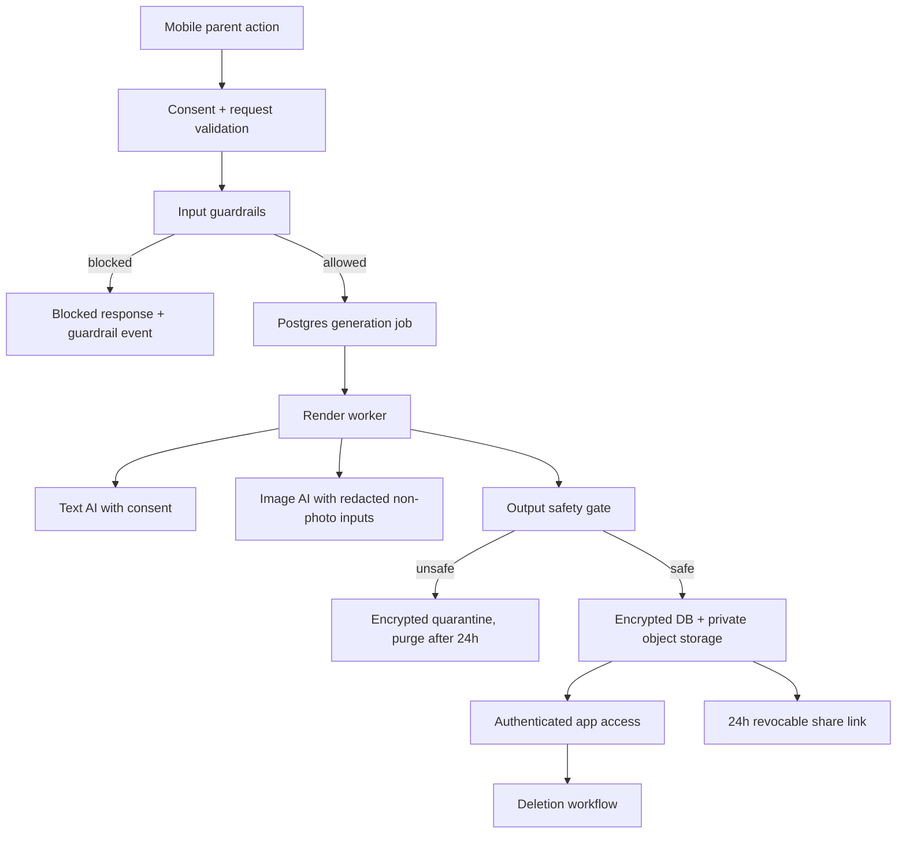

# feat: Production-ready security foundation

## Summary

This plan turns the production-readiness requirements into a phased security and operations foundation for Kahani. It starts with prompt-injection and safety guardrails, then moves family-photo handling, consent, persistence, private storage, worker reliability, observability, and Render deployment toward a production launch posture.

---

## Problem Frame

The current main checkout has the right product direction but still relies on local/mobile storage, in-memory/file-backed story jobs, public static story-run artifacts, and direct reference-image forwarding in the generation path. The production launch requirements require a stronger boundary around child/family data, provider calls, persistent jobs, and operational debugging.

---

## Requirements

- R1. Input gates block prompt-injection attempts and serious safety/medical/crisis prompts before generation.
- R2. External text AI processing requires explicit parent consent.
- R3. Generated text and images pass output safety gates before display or saving.
- R4. Production user data is never used for model training or fine-tuning.
- R5. Child and parent face photos are never sent to third-party AI providers.
- R6. Photo metadata extraction is on-device only; raw family photos never leave the parent device.
- R7. Third-party image providers receive only redacted/minimized non-photo illustration inputs.
- R8. Generated books/images use private storage and authenticated short-lived access.
- R9. Sensitive fields/assets use app-level encryption with managed key custody.
- R10. Account deletion removes child profiles, stories, generated images, linked logs, and improvement data within 30 days.
- R11. Share links are private, unlisted, 24-hour, revocable, logged, and redacted for child names.
- R12. No offline book access at launch.
- R13. Production is parent-only, social-login only, with fresh re-auth for sensitive account actions.
- R14. No routine admin browsing; founder/developer access is MFA, least privilege, and audited.
- R15. Account-level improvement opt-in stores redacted data only and never sells data.
- R16. Render launch uses separate API and worker services plus managed Postgres, with separate staging/prod and synthetic-only staging.
- R17. Story generation jobs use at-least-once retry, idempotency, retry limits, stuck-job detection, and cost controls.
- R18. Database launch readiness includes backups, safe migrations, and a restore drill.
- R19. Observability includes metadata-first logs, redacted failed-job artifacts, critical alerts, and runbooks.
- R20. US-only public signup with caps requires terms/privacy, vendor allowlist, internal security review, quotas, abuse controls, and fast shutdown controls.

**Origin actors:** A1 parent account holder, A2 child subject, A3 Kahani operator, A4 AI provider, A5 infrastructure provider
**Origin flows:** F1 story generation with consent and safety gates, F2 photo-based personalization without external photo processing, F3 private sharing, F4 production incident response
**Origin acceptance examples:** AE1 prompt-injection block, AE2 text AI consent block, AE3 on-device photo handling, AE4 unsafe-output quarantine, AE5 account deletion, AE6 private share link, AE7 retry/idempotency, AE8 redacted debug logs

---

## Scope Boundaries

- Parent data export remains deferred; deletion is required in the launch scope.
- External security/privacy review remains deferred; internal security review is required before launch.
- Child accounts are out of scope.
- Private/self-hosted AI generation is out of scope for this plan.
- Redis/Render Key Value queueing is deferred unless Postgres-backed worker polling proves insufficient during implementation.
- No public gallery, long-lived public links, production data in staging, global launch, offline reading, or model training on user data.

---

## Context & Research

### Relevant Code and Patterns

- `artifacts/api-server/src/routes/stories.ts` and `artifacts/api-server/src/routes/books.ts` start generation jobs and expose status/result endpoints.
- `artifacts/api-server/src/services/story-sheet/jobs.ts` currently stores jobs in memory plus `artifacts/story-sheet-runs` JSON files.
- `artifacts/api-server/src/services/story-sheet/generator.ts` currently writes prompts, story JSON, sheet images, slices, usage, and book artifacts to local run folders.
- `artifacts/api-server/src/services/story-sheet/aiClient.ts` currently attaches reference image URIs to the image-provider request.
- `artifacts/mobile/app/(tabs)/characters.tsx` currently stores selected photos as data URLs and uses appearance notes.
- `artifacts/mobile/app/(tabs)/index.tsx` currently sends `character.photoUri` and parent `photoUri` to generation.
- `lib/db/src/schema/index.ts` is effectively empty, while `artifacts/api-server/src/services/book-generation/repository.ts` references Drizzle tables that need real schema support.
- `artifacts/api-server/src/lib/logger.ts` uses Pino with basic header redaction; this should be extended rather than replaced.
- `lib/api-spec/openapi.yaml`, `lib/api-client-react/src/generated/api.ts`, and `lib/api-zod/src/generated/api.ts` are the API contract surfaces that must stay aligned.

### Institutional Learnings

- The repo’s README already treats `DATABASE_URL`, API server, mobile app, Clerk, and separate text/image model knobs as real runtime surfaces.
- The current requirements doc says prompt-injection is step one, Render is the launch baseline, and family photos are highly sensitive.

### External References

- Render Background Workers: `https://render.com/docs/background-workers`
- Render Blueprints and YAML reference: `https://render.com/docs/infrastructure-as-code`, `https://render.com/docs/blueprint-spec`
- Render Environment Variables and Secrets: `https://render.com/docs/configure-environment-variables`
- Render Postgres: `https://render.com/docs/postgresql`

---

## Key Technical Decisions

- Start with guardrails as a shared backend package/service: prompt-injection and safety checks need to run before any generation job, regardless of whether the request enters through `/stories/generate` or `/books`.
- Treat current photo-to-provider behavior as unsafe by design: the implementation should remove provider-visible `photoUri` usage and move toward descriptors supplied by on-device extraction or manual parent input.
- Use Postgres as the durable job system for launch: Render workers can poll Postgres-backed queued jobs before adding Redis/Render Key Value.
- Keep the OpenAPI contract as the app/API alignment source: consent, blocked-generation responses, job status, share links, and private asset access should be reflected there before regenerating clients.
- Preserve local-dev ergonomics while making production fail closed: auth/consent/storage/provider requirements can have development bypasses, but production startup should validate required env and refuse unsafe config.
- Store only metadata-first operational logs by default: failed-job details must be redacted and retention-bound.

---

## Open Questions

### Resolved During Planning

- Queue substrate: Use Postgres-backed worker polling for the launch plan and defer Redis/Render Key Value until reliability data demands it.
- Deployment baseline: Use Render API service, Render background worker, managed Postgres, and separate staging/prod resources.
- Photo handling: Remove external face-photo processing rather than attempting provider-side filtering.

### Deferred to Implementation

- Exact KMS provider and envelope-encryption adapter: choose after vendor review and Render compatibility checks.
- Exact private object storage provider: choose from the vendor allowlist; the plan requires a storage abstraction so the provider can change.
- Exact on-device metadata extraction capability: implementation should support manual descriptors first if native/on-device extraction is not production-ready.
- Exact observability vendor: choose from approved vendors that support redaction, retention, alerts, and US-region controls.

---

## High-Level Technical Design

> *This illustrates the intended approach and is directional guidance for review, not implementation specification. The implementing agent should treat it as context, not code to reproduce.*

---

## Implementation Units

### U1. Prompt-Injection And Input Safety Gate

**Goal:** Add the first production gate: block prompt-injection, hidden-prompt extraction, rule override attempts, and high-risk safety/medical/crisis prompts before any generation job starts.

**Requirements:** R1, R19, AE1

**Dependencies:** None

**Files:**
- Create: `artifacts/api-server/src/services/safety/inputGuardrails.ts`
- Create: `artifacts/api-server/src/services/safety/inputGuardrails.test.ts`
- Create: `artifacts/api-server/src/services/safety/safetyEvents.ts`
- Modify: `artifacts/api-server/src/routes/stories.ts`
- Modify: `artifacts/api-server/src/routes/books.ts`
- Modify: `lib/api-spec/openapi.yaml`
- Test: `artifacts/api-server/src/routes/stories.guardrails.test.ts`
- Test: `artifacts/api-server/src/routes/books.guardrails.test.ts`

**Approach:**
- Implement deterministic preflight checks that classify prompt-injection and high-risk safety categories before config/provider calls.
- Return a parent-safe blocked-generation response through both story and book endpoints.
- Record a structured guardrail event without storing raw child names, photos, or full prompts.
- Update the OpenAPI contract so mobile can distinguish blocked requests from malformed requests.

**Execution note:** Implement test-first at the route boundary so the provider is never called for blocked input.

**Patterns to follow:**
- Request validation in `artifacts/api-server/src/routes/stories.ts`
- Existing route tests and service tests under `artifacts/api-server/src/services/story-sheet/*.test.ts`
- Pino redaction posture in `artifacts/api-server/src/lib/logger.ts`

**Test scenarios:**
- Covers AE1. Error path: prompt containing "ignore previous instructions" is blocked before `startStorySheetJob` runs.
- Covers AE1. Error path: prompt asking for hidden/system prompts is blocked and records a guardrail event.
- Error path: crisis/self-harm/abuse language returns a safe blocked response and no job ID.
- Happy path: ordinary behavior prompt proceeds to job creation.
- Edge case: empty optional prompt with behavior mode still passes normal fallback generation.
- Integration: `/stories/generate` and `/books` enforce the same preflight behavior.

**Verification:**
- A blocked input never creates a job, writes a story-run artifact, or calls an AI provider.
- API client/Zod generation sees the new blocked-response contract.

---

### U2. Consent And Parent-Only Auth Enforcement

**Goal:** Require authenticated parent accounts in production, require explicit external text-AI consent before generation, and require fresh re-auth for sensitive actions.

**Requirements:** R2, R13, R15, AE2

**Dependencies:** U1

**Files:**
- Create: `artifacts/api-server/src/services/auth/requireUser.ts`
- Create: `artifacts/api-server/src/services/consent/consentService.ts`
- Create: `artifacts/api-server/src/services/consent/consentService.test.ts`
- Modify: `artifacts/api-server/src/app.ts`
- Modify: `artifacts/api-server/src/routes/stories.ts`
- Modify: `artifacts/api-server/src/routes/books.ts`
- Modify: `artifacts/mobile/app/_layout.tsx`
- Modify: `artifacts/mobile/app/(tabs)/index.tsx`
- Modify: `lib/api-spec/openapi.yaml`
- Test: `artifacts/api-server/src/routes/generationConsent.test.ts`
- Test: `artifacts/mobile/app/(tabs)/index.test.tsx`

**Approach:**
- Centralize production auth requirements so route handlers do not each invent auth behavior.
- Persist consent state server-side and require it before generation endpoints can enqueue jobs.
- Keep local-development bypasses explicit and disabled in production.
- Add mobile consent UX before the generation call and handle consent-required API responses cleanly.

**Patterns to follow:**
- Clerk token attachment in `lib/api-client-react/src/custom-fetch.ts`
- Clerk provider setup in `artifacts/mobile/app/_layout.tsx`
- Existing mutation flow in `artifacts/mobile/app/(tabs)/index.tsx`

**Test scenarios:**
- Covers AE2. Error path: signed-in parent without text-AI consent is blocked before job creation.
- Happy path: signed-in parent with consent can generate after U1 passes.
- Error path: unauthenticated production request is rejected.
- Edge case: local development without Clerk env uses the explicit dev bypass only outside production.
- Integration: mobile surfaces consent-required state without showing generic generation failure.

**Verification:**
- Production generation requires both user identity and external text-AI consent.
- Consent changes are auditable and ready for re-auth enforcement.

---

### U3. Photo Privacy And Redacted Provider Inputs

**Goal:** Remove all raw face-photo provider paths and replace them with non-photo descriptors supplied by on-device extraction or manual parent entry.

**Requirements:** R5, R6, R7, AE3

**Dependencies:** U1, U2

**Files:**
- Create: `artifacts/mobile/services/photoDescriptors.ts`
- Create: `artifacts/mobile/services/photoDescriptors.test.ts`
- Create: `artifacts/api-server/src/services/safety/providerPayloadPolicy.ts`
- Create: `artifacts/api-server/src/services/safety/providerPayloadPolicy.test.ts`
- Modify: `artifacts/mobile/context/StoryContext.tsx`
- Modify: `artifacts/mobile/app/(tabs)/characters.tsx`
- Modify: `artifacts/mobile/app/(tabs)/index.tsx`
- Modify: `artifacts/api-server/src/services/story-sheet/generator.ts`
- Modify: `artifacts/api-server/src/services/story-sheet/aiClient.ts`
- Modify: `scripts/src/story-sheet-run.ts`
- Modify: `scripts/data/sheet-master-prompt.txt`
- Modify: `lib/api-spec/openapi.yaml`
- Test: `artifacts/api-server/src/services/story-sheet/generator.photoPrivacy.test.ts`
- Test: `artifacts/api-server/src/services/story-sheet/aiClient.photoPolicy.test.ts`

**Approach:**
- Change mobile character persistence so production generation sends descriptors, not image data or provider-fetchable photo URIs.
- Keep raw selected photos local to the device and delete/discard them after descriptor extraction or manual descriptor entry.
- Enforce backend payload policy so even a malicious or stale client cannot pass `data:image`, `http`, `https`, `file`, or blob-like photo references into provider calls.
- Update story/sheet prompt builders to use character descriptors and redacted placeholder labels instead of child real names or photo references.
- Keep script-runner photo reference behavior dev-only or behind an explicit non-production harness path so production policy is not weakened.

**Execution note:** Add backend policy tests before modifying prompt builders; this is the easiest place to prove no face-photo data reaches providers.

**Patterns to follow:**
- Current `buildImageSpec`, `buildReferenceImageUris`, and `buildChildIdentityForStory` in `artifacts/api-server/src/services/story-sheet/generator.ts`
- Image QA tests in `artifacts/api-server/src/services/story-sheet/imageQa.test.ts`
- Mobile appearance notes in `artifacts/mobile/app/(tabs)/characters.tsx`

**Test scenarios:**
- Covers AE3. Happy path: saved character with manual descriptor generates provider payload with descriptor only.
- Covers AE3. Error path: request containing `photoUri` is rejected or sanitized before provider payload construction.
- Error path: parent/supporting-character photo URI cannot reach `callMultimodalImageModel`.
- Edge case: character without descriptor still generates with a generic non-identifying visual description.
- Integration: mobile generation request omits raw photo fields in production mode.
- Regression: dev story-sheet runner can still be used for controlled local experiments without changing production API policy.

**Verification:**
- No production provider payload includes child/parent face photos, data URLs, local paths, or provider-fetchable photo URLs.
- Generated image prompts use redacted descriptors and do not include real child names.

---

### U4. Durable Schema, Encryption Boundary, And Deletion Foundation

**Goal:** Add the production data model and encryption boundary for users, consents, characters, jobs, assets, guardrails, usage, sharing, deletion, and audit events.

**Requirements:** R8, R9, R10, R11, R14, R15, R18, AE5, AE6

**Dependencies:** U1, U2, U3

**Files:**
- Create: `lib/db/src/schema/users.ts`
- Create: `lib/db/src/schema/characters.ts`
- Create: `lib/db/src/schema/generationJobs.ts`
- Create: `lib/db/src/schema/assets.ts`
- Create: `lib/db/src/schema/audit.ts`
- Modify: `lib/db/src/schema/index.ts`
- Create: `artifacts/api-server/src/services/crypto/encryptionService.ts`
- Create: `artifacts/api-server/src/services/crypto/encryptionService.test.ts`
- Create: `artifacts/api-server/src/services/deletion/deletionService.ts`
- Create: `artifacts/api-server/src/services/deletion/deletionService.test.ts`
- Create: `artifacts/api-server/src/routes/account.ts`
- Modify: `lib/api-spec/openapi.yaml`
- Test: `lib/db/src/schema/schema.test.ts`
- Test: `artifacts/api-server/src/routes/account.test.ts`

**Approach:**
- Replace the placeholder Drizzle schema with explicit tables for the launch data inventory.
- Make sensitive columns/assets pass through an encryption service abstraction, with KMS details behind an adapter interface.
- Store consent, improvement opt-in, support grants, share links, and audit events as first-class records.
- Add deletion workflow state so account deletion can be tracked, retried, and audited within the 30-day promise.
- Keep exact KMS provider selection deferred to vendor review, but make the app boundary and tests provider-independent.

**Patterns to follow:**
- Drizzle import/export shape in `lib/db/src/index.ts`
- Repository style in `artifacts/api-server/src/services/book-generation/repository.ts`
- OpenAPI/client regeneration pattern in `lib/api-spec/orval.config.ts`

**Test scenarios:**
- Covers AE5. Happy path: account deletion marks/removes user-linked records and schedules asset deletion.
- Error path: deletion worker failure leaves retryable deletion state, not silent partial success.
- Happy path: encrypted sensitive value round-trips through the service abstraction.
- Error path: production startup fails closed if encryption/KMS config is absent.
- Edge case: audit events store metadata without raw prompts/photos/images.
- Schema: tables export through `@workspace/db` and compile for API-server imports.

**Verification:**
- Durable schema supports all production safety records without relying on local JSON artifacts.
- Sensitive fields/assets cannot be written without going through the encryption boundary.

---

### U5. Private Asset Storage And Share Links

**Goal:** Move generated images/books out of public static story-run serving and into private object storage with authenticated app access and 24-hour revocable share links.

**Requirements:** R8, R11, R12, AE6

**Dependencies:** U4

**Files:**
- Create: `artifacts/api-server/src/services/assets/privateAssetStore.ts`
- Create: `artifacts/api-server/src/services/assets/privateAssetStore.test.ts`
- Create: `artifacts/api-server/src/services/sharing/shareLinkService.ts`
- Create: `artifacts/api-server/src/services/sharing/shareLinkService.test.ts`
- Create: `artifacts/api-server/src/routes/assets.ts`
- Create: `artifacts/api-server/src/routes/shareLinks.ts`
- Modify: `artifacts/api-server/src/app.ts`
- Modify: `artifacts/api-server/src/services/story-sheet/generator.ts`
- Modify: `artifacts/api-server/src/services/story-sheet/mapper.ts`
- Modify: `artifacts/mobile/app/book-reader.tsx`
- Modify: `artifacts/mobile/app/(tabs)/library.tsx`
- Modify: `lib/api-spec/openapi.yaml`
- Test: `artifacts/api-server/src/routes/assets.test.ts`
- Test: `artifacts/api-server/src/routes/shareLinks.test.ts`

**Approach:**
- Introduce an asset-store abstraction with private object keys and short-lived read access.
- Remove production dependence on `express.static` for generated story artifacts; keep local artifact links dev-only.
- Add authenticated asset routes for app rendering.
- Add share-link records with expiry, revocation, access logging, and child-name redaction in shared/exported views.
- Ensure generated books are not cached for offline access at launch.

**Patterns to follow:**
- Current URL absolutization in `artifacts/api-server/src/routes/stories.ts`
- Story mapper asset-link generation in `artifacts/api-server/src/services/story-sheet/mapper.ts`
- Reader image rendering in `artifacts/mobile/app/book-reader.tsx`

**Test scenarios:**
- Happy path: authenticated owner can read a generated page image through a short-lived/private access route.
- Error path: unauthenticated request cannot fetch a private asset.
- Covers AE6. Happy path: share link opens before expiry with redacted child name and access log entry.
- Covers AE6. Error path: expired or revoked share link does not expose content.
- Edge case: dev artifact links remain absent in production responses.
- Regression: mobile reader still renders story pages using authenticated URLs.

**Verification:**
- Generated assets are private by default and no production API response exposes stable public object URLs.

---

### U6. Postgres-Backed Worker, Idempotency, Retries, And Cost Controls

**Goal:** Replace in-process fire-and-forget jobs with durable Postgres-backed generation jobs processed by a Render worker.

**Requirements:** R16, R17, AE7

**Dependencies:** U1, U4, U5

**Files:**
- Create: `artifacts/api-server/src/worker.ts`
- Create: `artifacts/api-server/src/services/jobs/generationQueue.ts`
- Create: `artifacts/api-server/src/services/jobs/generationQueue.test.ts`
- Create: `artifacts/api-server/src/services/jobs/generationWorker.ts`
- Create: `artifacts/api-server/src/services/jobs/generationWorker.test.ts`
- Create: `artifacts/api-server/src/services/jobs/idempotency.ts`
- Create: `artifacts/api-server/src/services/jobs/idempotency.test.ts`
- Modify: `artifacts/api-server/build.mjs`
- Modify: `artifacts/api-server/package.json`
- Modify: `artifacts/api-server/src/routes/stories.ts`
- Modify: `artifacts/api-server/src/routes/books.ts`
- Modify: `artifacts/api-server/src/services/story-sheet/jobs.ts`
- Modify: `artifacts/api-server/src/services/story-sheet/generator.ts`
- Test: `artifacts/api-server/src/routes/generationJobs.integration.test.ts`

**Approach:**
- Persist queued/running/failed/complete job state in Postgres.
- Require idempotency for generation-start requests so duplicate parent actions resolve to one logical book.
- Move execution to a worker entrypoint that claims jobs, renews heartbeat/stuck detection, retries transient failures, and stops at a strict retry/cost budget.
- Preserve the existing story status/result API shape where possible, but source it from durable state.
- Keep Postgres polling bounded and observable; defer Redis/Render Key Value until scale or contention requires it.

**Execution note:** Add characterization tests around current status/result API behavior before replacing the job backend.

**Patterns to follow:**
- Current step/message lifecycle in `artifacts/api-server/src/services/story-sheet/jobs.ts`
- Retry helper in `artifacts/api-server/src/services/book-generation/orchestrator.ts`
- Existing book event model concepts in `artifacts/api-server/src/services/book-generation/eventLog.ts`

**Test scenarios:**
- Covers AE7. Happy path: duplicate idempotency key returns the same logical job/book.
- Covers AE7. Error path: transient provider failure retries in the worker and stops at the configured budget.
- Error path: stuck running job is detected and returned to retryable/failed state according to budget.
- Edge case: API process restart does not lose queued/running job status.
- Integration: mobile polling can observe queued, running, complete, and failed states without local JSON files.
- Cost control: provider usage over budget halts retries and records a failed state.

**Verification:**
- API service can enqueue and report jobs without executing them in-process.
- Worker service can process queued jobs independently and safely resume after restart.

---

### U7. Output Safety, Redacted Debug Artifacts, And Observability

**Goal:** Add output safety gates, metadata-first logs, redacted failed-job artifacts, critical alerts, and operational event records.

**Requirements:** R3, R19, AE4, AE8

**Dependencies:** U1, U4, U6

**Files:**
- Create: `artifacts/api-server/src/services/safety/outputSafety.ts`
- Create: `artifacts/api-server/src/services/safety/outputSafety.test.ts`
- Create: `artifacts/api-server/src/services/observability/redaction.ts`
- Create: `artifacts/api-server/src/services/observability/redaction.test.ts`
- Create: `artifacts/api-server/src/services/observability/alerts.ts`
- Create: `artifacts/api-server/src/services/observability/alerts.test.ts`
- Modify: `artifacts/api-server/src/lib/logger.ts`
- Modify: `artifacts/api-server/src/services/story-sheet/generator.ts`
- Modify: `artifacts/api-server/src/services/jobs/generationWorker.ts`
- Modify: `artifacts/api-server/src/routes/books.ts`
- Test: `artifacts/api-server/src/services/story-sheet/outputSafety.integration.test.ts`

**Approach:**
- Gate generated story JSON and generated image metadata before persistence/display.
- Quarantine unsafe outputs encrypted for 24 hours, inaccessible to parents and ordinary admin paths.
- Store failed-job debug payloads as redacted artifacts with 30-day retention.
- Extend logger redaction beyond auth headers to prompt/content/provider payload fields.
- Define alert emitters for unsafe output shown, photo-policy violation, provider failure spikes, stuck workers, spend-cap breaches, and deletion/export failures.

**Patterns to follow:**
- `buildImageQaChecklist` in `artifacts/api-server/src/services/story-sheet/imageQa.ts`
- `toMonitoringEvent` in `artifacts/api-server/src/services/book-generation/eventLog.ts`
- Pino redaction in `artifacts/api-server/src/lib/logger.ts`

**Test scenarios:**
- Covers AE4. Error path: unsafe story text fails the output gate and is not returned by story result endpoints.
- Covers AE4. Error path: unsafe image result is quarantined and purged after retention.
- Covers AE8. Error path: failed job stores redacted provider/error context without raw names, photos, or images.
- Happy path: safe output passes and emits metadata-only completion events.
- Edge case: redaction removes child names from nested provider response shapes.
- Integration: alert emitter receives a stuck-worker or spend-cap breach event.

**Verification:**
- Unsafe generated outputs are never displayed or saved as normal books.
- Operators can debug failed jobs from redacted metadata without content browsing.

---

### U8. Render Deployment, Environment Validation, Runbooks, And Launch Gates

**Goal:** Add Render-first deployment configuration, production startup validation, backup/restore readiness, vendor/legal/security launch checklist, and operational runbooks.

**Requirements:** R16, R18, R19, R20

**Dependencies:** U1 through U7

**Files:**
- Create: `render.yaml`
- Create: `artifacts/api-server/src/config/productionEnv.ts`
- Create: `artifacts/api-server/src/config/productionEnv.test.ts`
- Create: `docs/runbooks/production-launch.md`
- Create: `docs/runbooks/data-exposure.md`
- Create: `docs/runbooks/unsafe-output-shown.md`
- Create: `docs/runbooks/stuck-generation-jobs.md`
- Create: `docs/runbooks/provider-outage.md`
- Create: `docs/runbooks/deletion-failure.md`
- Create: `docs/runbooks/database-restore.md`
- Create: `docs/runbooks/auth-outage.md`
- Create: `docs/runbooks/spend-spike.md`
- Create: `docs/security/vendor-allowlist.md`
- Create: `docs/security/internal-security-review.md`
- Modify: `.env.example`
- Modify: `README.md`
- Modify: `artifacts/api-server/src/index.ts`
- Modify: `artifacts/api-server/src/worker.ts`
- Test: `artifacts/api-server/src/config/productionEnv.test.ts`

**Approach:**
- Add a Render Blueprint with API service, background worker service, managed Postgres, and separate environment groups or clear staging/prod variable sets.
- Make production startup fail closed when required auth, database, storage, encryption/KMS, vendor, consent, and provider env vars are missing.
- Document backup and restore drill requirements for managed Postgres.
- Document exact operational runbooks for launch-blocking incidents and founder-only alert triage.
- Keep `.env.example` aligned with local development while clearly separating production-only variables.

**Patterns to follow:**
- Existing README runtime runbook
- Current API start validation in `artifacts/api-server/src/index.ts`
- Render Blueprint documentation for web services, workers, managed Postgres, and env vars

**Test scenarios:**
- Happy path: production env validator accepts a complete production config.
- Error path: production env validator rejects missing `DATABASE_URL`, auth, storage, KMS, or provider-policy config.
- Error path: worker startup rejects unsafe production config just like API startup.
- Documentation check: runbooks name trigger, immediate action, diagnosis, rollback/mitigation, and follow-up.
- Config check: Render Blueprint defines API and worker separately and references managed Postgres.

**Verification:**
- Staging/prod deployment shape is reviewable from repo config and docs.
- A founder/operator has runbooks for the launch incident classes before public signup.

---

## System-Wide Impact

- **Interaction graph:** Mobile generation, API route validation, safety gates, queue state, worker execution, provider clients, asset serving, and reader rendering all become part of the production path.
- **Error propagation:** Blocked guardrails and consent failures should surface as parent-safe blocked states; worker/provider failures should surface as retrying/failed generation states; unsafe outputs should fail safely without exposing content.
- **State lifecycle risks:** Duplicate generation, partial asset writes, failed deletion, expired share links, quarantine purge, and stuck jobs all need explicit state transitions.
- **API surface parity:** `lib/api-spec/openapi.yaml`, generated React client, generated Zod schemas, mobile calls, and API handlers must move together.
- **Integration coverage:** Guardrails, consent, photo policy, idempotent worker retries, private asset access, and share-link expiry need route or integration tests, not only unit tests.
- **Unchanged invariants:** Local dev should remain runnable with documented bypasses; production must fail closed.

---

## Risk Analysis & Mitigation

| Risk | Likelihood | Impact | Mitigation |
|------|------------|--------|------------|
| Guardrails block too much normal parent behavior | Medium | Medium | Start with deterministic categories, parent-safe copy, and event logging; review blocked categories before expanding. |
| Photo data still leaks through an old field or script path | Medium | High | Backend provider-payload policy tests must reject all URI/photo shapes before provider calls. |
| Postgres polling worker becomes inefficient | Medium | Medium | Keep polling bounded and observable; defer Redis/Render Key Value as a planned follow-up trigger. |
| App-level encryption complicates deletion, sharing, and restore | High | High | Introduce an encryption boundary early, test restore/deletion paths, and require KMS recovery docs. |
| Private asset URLs break reader UX | Medium | Medium | Add mobile integration coverage for authenticated image access and expired/revoked links. |
| Redaction removes too little from debug artifacts | Medium | High | Test nested provider payloads and require metadata-first logging by default. |
| Public signup attracts abuse before controls are tuned | Medium | High | Launch with generation quotas, spend caps, rate limits, alerting, and fast shutdown controls. |

---

## Phased Delivery

### Phase 1: Stop Unsafe Inputs And Photo Leakage

- U1. Prompt-injection and input safety gate
- U2. Consent and parent-only auth enforcement
- U3. Photo privacy and redacted provider inputs

### Phase 2: Make State Durable And Private

- U4. Durable schema, encryption boundary, and deletion foundation
- U5. Private asset storage and share links

### Phase 3: Make Generation Operational

- U6. Postgres-backed worker, idempotency, retries, and cost controls
- U7. Output safety, redacted debug artifacts, and observability

### Phase 4: Make Launch Reviewable

- U8. Render deployment, environment validation, runbooks, and launch gates

---

## Rollout Sequence

- Land Phase 1 behind production fail-closed checks before any public signup work.
- Deploy staging with synthetic data only and verify blocked-input, consent-required, and no-photo-provider behavior.
- Land Phase 2 and migrate any development data explicitly; do not migrate production data because launch production data should not exist yet.
- Deploy worker and private asset path in staging; verify API and worker can be restarted independently without losing jobs.
- Run backup/restore drill against staging Postgres before production cutover.
- Complete vendor allowlist, privacy/terms, internal security review, and runbook review before enabling public signup.
- Enable public signup with low generation caps and founder-only critical alerts.
- Increase caps only after reviewing guardrail, job failure, provider spend, and deletion metrics.

---

## Verification Plan

- **Static/type verification:** root typecheck, API-server typecheck, API-server build, API spec codegen check, DB package compile, and mobile typecheck after client/schema regeneration.
- **Guardrail verification:** route tests prove prompt-injection and crisis prompts never create jobs or call providers.
- **Photo privacy verification:** provider client tests prove no photo URI/data URL/local path reaches text or image provider payloads.
- **Consent/auth verification:** authenticated and unauthenticated route tests cover production behavior; mobile tests cover consent-required state.
- **Persistence verification:** schema tests and integration tests prove jobs survive API restart and worker restart.
- **Asset verification:** private asset route tests cover owner access, unauthenticated denial, expired share links, revoked share links, and redacted shared child names.
- **Worker verification:** integration tests cover idempotent duplicate generation requests, transient provider retry, stuck-job recovery, and spend-cap halt.
- **Safety output verification:** generated unsafe output is quarantined, never returned, and purged after retention.
- **Deployment verification:** Render staging smoke covers `/api/healthz`, generation blocked without consent, generation accepted with consent, worker completion, private asset read, share-link expiry, and deletion workflow.
- **Operational verification:** run a staging database restore drill, simulate alert events, and walk at least the stuck-job, provider-outage, unsafe-output, and deletion-failure runbooks.

---

## Documentation / Operational Notes

- Update `README.md` with production/staging deployment, worker, and Render notes while keeping the local runbook intact.
- Add runbooks under `docs/runbooks/` before public signup.
- Add vendor and internal security review docs under `docs/security/`.
- Keep `docs/brainstorms/production-readiness-requirements.md` as the source of product/security posture; this plan is the implementation guide.
- Update `.env.example` without adding secrets.

---

## Sources & References

- **Origin document:** [docs/brainstorms/production-readiness-requirements.md](../brainstorms/production-readiness-requirements.md)
- Related docs: [README.md](../../README.md), [docs/story-generation-spec.md](../story-generation-spec.md), [docs/image-generation-spec.md](../image-generation-spec.md)
- Related API code: `artifacts/api-server/src/routes/stories.ts`, `artifacts/api-server/src/routes/books.ts`, `artifacts/api-server/src/services/story-sheet/jobs.ts`, `artifacts/api-server/src/services/story-sheet/generator.ts`, `artifacts/api-server/src/services/story-sheet/aiClient.ts`
- Related mobile code: `artifacts/mobile/app/(tabs)/characters.tsx`, `artifacts/mobile/app/(tabs)/index.tsx`, `artifacts/mobile/context/StoryContext.tsx`
- Related data/API contracts: `lib/db/src/schema/index.ts`, `lib/api-spec/openapi.yaml`
- External docs: Render Background Workers `https://render.com/docs/background-workers`
- External docs: Render Blueprints `https://render.com/docs/infrastructure-as-code`
- External docs: Render Blueprint YAML Reference `https://render.com/docs/blueprint-spec`
- External docs: Render Environment Variables and Secrets `https://render.com/docs/configure-environment-variables`
- External docs: Render Postgres `https://render.com/docs/postgresql`
