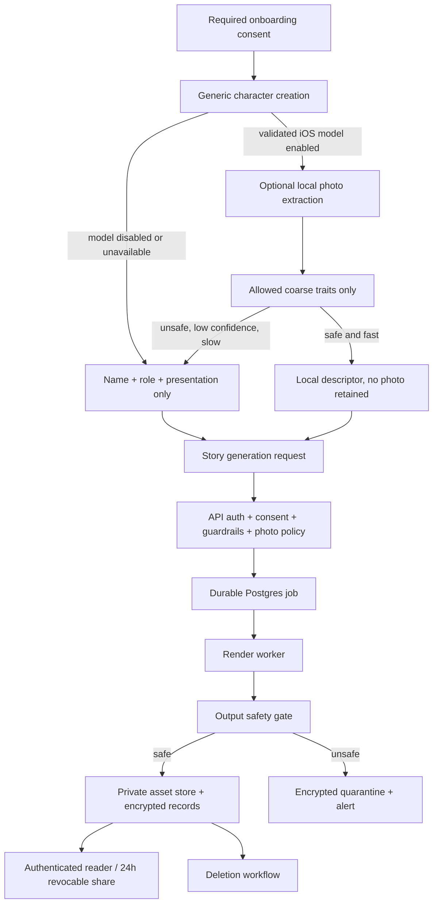

# feat: Production hardening follow-on

## Summary

This follow-on plan completes the production-readiness work that remains after the current branch foundation: required onboarding consent and metadata analytics, production-safe generic character creation, local-only photo extraction gating, encryption/deletion, private assets/share links, durable workers, output safety/observability, and Render launch runbooks.

The plan assumes the current feature branch already contains the first production safety slice: prompt-injection guardrails, request-level text-AI consent, provider photo stripping, redacted image prompts, generated API clients, and initial Drizzle table exports. Execution should verify that state rather than reimplementing it.

---

## Problem Frame

Kahani is moving from local/demo story generation toward a production parent/child app that handles sensitive family data. The highest-risk gaps now are not the initial guardrails; they are the durable launch surfaces around consent, analytics, encrypted persistence, deletion, private generated assets, worker reliability, output safety, operational visibility, and Render deployment.

The new local photo-trait requirements add one important product rule: production must not imply photo personalization until the local iOS extraction model is proven safe. The app should hide the current photo picker for production, ship a generic character flow, and only later enable optional offline extraction if an auditable bundled model passes validation.

---

## Requirements Trace

From `docs/brainstorms/2026-05-19-local-photo-trait-extraction-requirements.md`:
- Local R1-R5: required onboarding consent, anonymous install analytics, and no content/trait analytics.
- Local R6-R9: hide photo picker until extraction is ready, generic character fallback, and optional extraction only.
- Local R10-R19: iOS-only auditable bundled model, sub-second extraction, allowed/disallowed traits, photo discard, local-only descriptor retention, and production-hidden trait text.
- Local R20-R22: provider boundary stays redacted and photo-free.
- Local R23-R25: photo picker remains gated by internal validation; extraction runs only at character creation.

From `docs/brainstorms/production-readiness-requirements.md` and `docs/plans/2026-05-19-001-feat-production-readiness-plan.md`:
- Production R8-R11: private generated assets, encryption, deletion within 30 days, and revocable private share links.
- Production R16-R18: Render API/worker/Postgres launch shape, durable jobs, retries, idempotency, cost controls, backups, and restore drill.
- Production R19-R20: metadata-first observability, critical alerts, runbooks, US-only launch posture, vendor allowlist, quotas, abuse controls, and fast shutdown.

---

## Current State

- `artifacts/api-server/src/routes/stories.ts` and `artifacts/api-server/src/routes/books.ts` now have guardrail, auth, and request-level consent gates in the current branch.
- `artifacts/api-server/src/services/safety/providerPayloadPolicy.ts` strips provider-visible photo references in the current branch.
- `artifacts/api-server/src/services/story-sheet/generator.ts` now builds redacted image prompts in the current branch.
- `artifacts/mobile/app/(tabs)/characters.tsx` still exposes a photo picker and stores selected photos locally for preview; this must not ship in production until local extraction is validated.
- `artifacts/mobile/services/photoDescriptors.ts` currently creates descriptors from parent-entered text/presentation, not from local image analysis.
- `lib/db/src/schema/*.ts` table exports exist in the current branch, but encryption, deletion routes, durable job repositories, asset access, and audit workflows are not complete.
- `artifacts/api-server/src/app.ts` still serves local story-run artifacts via `express.static`, which is not production-private.

---

## Key Technical Decisions

- Treat the existing current-branch safety work as the foundation and extend from it; do not re-plan or duplicate the already-started U1-U3 work from the original production plan.
- Make required onboarding consent the app-level gate for both generation and metadata analytics. Route-level generation consent can remain as a defense-in-depth check until server-side consent persistence is complete.
- Hide production photo picking before solving local extraction. This aligns the visible product with the privacy promise and avoids retaining family photos locally for preview.
- Use anonymous install analytics for product behavior metadata only; do not use child, character, account, prompt, photo, descriptor, or generated-content identifiers in analytics payloads.
- Keep local photo extraction behind a production-readiness gate. If model research cannot prove an auditable bundled iOS model meets the one-second and non-sensitive-traits bar, ship generic-only.
- Use provider-independent abstractions for encryption, private assets, analytics, alerts, and worker queues so vendor choices can be changed after security/vendor review.
- Use Postgres-backed durable generation jobs for launch, with bounded polling on Render workers. Render’s worker docs support continuous background services that poll a queue, and the existing Render plan already chose Postgres before adding Redis.
- Render deployment should use separate API and background worker services with managed Postgres and environment groups/secrets. Render docs support environment groups/secrets, Blueprints, background workers, and paid Postgres PITR/logical backups.

---

## High-Level Technical Design

> This illustrates the intended approach and is directional guidance for review, not implementation specification. The implementing agent should treat it as context, not code to reproduce.

---

## Implementation Units

### U1. Required Consent, Anonymous Analytics, And Production-Safe Character Creation

**Goal:** Add the app-level consent gate, metadata-only analytics baseline, and production generic character flow that hides the current photo picker until local extraction is approved.

**Requirements:** Local R1-R9, Local R23, AE1, AE2, AE5

**Dependencies:** Current branch U1-U3 foundation from `docs/plans/2026-05-19-001-feat-production-readiness-plan.md`

**Files:**
- Create: `artifacts/mobile/services/onboardingConsent.ts`
- Create: `artifacts/mobile/services/onboardingConsent.test.ts`
- Create: `artifacts/mobile/services/analytics.ts`
- Create: `artifacts/mobile/services/analytics.test.ts`
- Create: `artifacts/mobile/services/characterPrivacy.ts`
- Create: `artifacts/mobile/services/characterPrivacy.test.ts`
- Modify: `artifacts/mobile/app/_layout.tsx`
- Modify: `artifacts/mobile/app/(tabs)/characters.tsx`
- Modify: `artifacts/mobile/context/StoryContext.tsx`
- Modify: `artifacts/mobile/app/(tabs)/index.tsx`
- Modify: `artifacts/mobile/app.json`
- Test: `artifacts/mobile/app/(tabs)/characters.test.tsx`
- Test: `artifacts/mobile/app/onboardingConsent.test.tsx`

**Approach:**
- Add a required first-run consent state stored locally; without consent, the app should not show the main tabs or generation surfaces.
- Generate and persist an anonymous install ID after consent. Use it only for metadata events, not as a child/character/account identifier.
- Define an analytics event allowlist for flow usage, drop-off, extraction attempted/succeeded/failed, failure category, model version, duration bucket, platform/app version, and generation-after-extraction.
- Remove or production-gate the current photo picker and manual appearance notes in the Add Character flow. The production-safe flow should collect only name, child/adult role, and presentation choice until extraction is enabled.
- Keep any dev-only extraction/debug controls clearly behind non-production checks.

**Execution note:** Implement test-first around the production character creation contract so a photo picker cannot silently reappear in production.

**Patterns to follow:**
- Existing `AsyncStorage` profile persistence in `artifacts/mobile/context/StoryContext.tsx`
- Existing Clerk and app bootstrap in `artifacts/mobile/app/_layout.tsx`
- Current character creation UI in `artifacts/mobile/app/(tabs)/characters.tsx`

**Test scenarios:**
- Covers AE1. Given no consent state, app startup shows the required consent gate and does not render the main character/story tabs.
- Covers AE1. Given consent is declined, app access remains blocked and no analytics install ID is created.
- Covers AE5. Given consent is accepted, analytics creates an anonymous install ID and accepts only allowlisted metadata keys.
- Error path: analytics rejects or redacts attempted payload fields containing names, prompts, traits, photos, generated image URLs, or child/character IDs.
- Covers AE2. Given production mode and extraction is not enabled, Add Character does not render a photo picker or manual appearance notes.
- Happy path: creating a generic character stores name, role, and presentation and can be selected for generation.
- Integration: generation payload contains no `photoUri` and no hidden trait text for a generic-only character.

**Verification:**
- Production character creation no longer stores selected photos.
- Consent and analytics behavior can be verified without network provider credentials.
- Mobile typecheck and focused mobile service/UI tests pass.

---

### U2. Local Photo Extraction Gate, Model Evaluation, And Dev QA Harness

**Goal:** Define the production gate for optional iOS local extraction, create the model-evaluation artifact, and provide a dev-only harness for inspecting model output without exposing trait text in production.

**Requirements:** Local R10-R19, R23-R25, AE3, AE4, AE6

**Dependencies:** U1

**Files:**
- Create: `docs/security/local-photo-extraction-model-evaluation.md`
- Create: `artifacts/mobile/services/photoExtractionGate.ts`
- Create: `artifacts/mobile/services/photoExtractionGate.test.ts`
- Create: `artifacts/mobile/services/photoTraitPolicy.ts`
- Create: `artifacts/mobile/services/photoTraitPolicy.test.ts`
- Create: `artifacts/mobile/services/photoTraitExtractor.ts`
- Create: `artifacts/mobile/services/photoTraitExtractor.test.ts`
- Modify: `artifacts/mobile/app/(tabs)/characters.tsx`
- Modify: `artifacts/mobile/context/StoryContext.tsx`
- Test: `artifacts/mobile/app/(tabs)/characters.photoExtraction.test.tsx`

**Approach:**
- Add an explicit extraction gate that defaults to disabled in production.
- Document model acceptance criteria before integrating any model: auditable/open-source, bundled in the app binary, iOS-only for v1, fully offline, under one second, approved trait categories only, and failure behavior for disallowed categories.
- Add a policy validator that accepts only broad hair color, skin tone range, clothing colors, glasses, and approximate age band, and rejects the whole descriptor if disallowed categories appear.
- Add a placeholder/local adapter boundary for the eventual model. Until a model is selected, production returns “unavailable” and the UI remains generic-only.
- Add dev-only QA inspection for extraction output. Production UI may show only a local indicator such as “Uses local photo traits,” not trait text.

**Execution note:** Characterize the gate-disabled production behavior before adding any adapter path.

**Patterns to follow:**
- Existing descriptor helper in `artifacts/mobile/services/photoDescriptors.ts`
- Existing character local persistence in `artifacts/mobile/context/StoryContext.tsx`
- Expo config in `artifacts/mobile/app.json`

**Test scenarios:**
- Covers AE3. Given the gate is disabled, optional photo extraction is not offered and generic character creation still works.
- Covers AE4. Given model output contains a disallowed category, the policy rejects the whole descriptor and returns generic fallback.
- Happy path: allowed coarse traits are converted into a local descriptor and marked as photo-derived without exposing trait text in production UI.
- Error path: unsupported platform, timeout, low confidence, or model error returns generic fallback and emits only allowed metadata.
- Covers AE6. Deleting a character deletes the local descriptor and local photo-trait indicator state.
- Dev-only path: model output can be inspected in development builds, but the same control is absent in production.

**Verification:**
- The app can ship generic-only if no acceptable model is selected.
- The model evaluation document is specific enough for a future implementation to approve or reject a candidate model.
- No production path stores or displays raw trait text.

---

### U3. Complete Encryption Boundary, Consent Persistence, Audit, And Deletion Routes

**Goal:** Finish the unfinished U4 production data work: app-level encryption abstraction, persisted consent/audit records, deletion workflow, and account routes.

**Requirements:** Production R9, R10, R13-R15, R18, AE5; Local R1-R5

**Dependencies:** Current branch schema exports, U1

**Files:**
- Modify: `lib/db/src/schema/users.ts`
- Modify: `lib/db/src/schema/characters.ts`
- Modify: `lib/db/src/schema/generationJobs.ts`
- Modify: `lib/db/src/schema/assets.ts`
- Modify: `lib/db/src/schema/audit.ts`
- Modify: `lib/db/src/schema/index.ts`
- Create: `artifacts/api-server/src/services/crypto/encryptionService.ts`
- Create: `artifacts/api-server/src/services/crypto/encryptionService.test.ts`
- Create: `artifacts/api-server/src/services/consent/consentRepository.ts`
- Create: `artifacts/api-server/src/services/consent/consentRepository.test.ts`
- Create: `artifacts/api-server/src/services/audit/auditService.ts`
- Create: `artifacts/api-server/src/services/audit/auditService.test.ts`
- Create: `artifacts/api-server/src/services/deletion/deletionService.ts`
- Create: `artifacts/api-server/src/services/deletion/deletionService.test.ts`
- Create: `artifacts/api-server/src/routes/account.ts`
- Modify: `artifacts/api-server/src/routes/index.ts`
- Modify: `lib/api-spec/openapi.yaml`
- Test: `lib/db/src/schema/schema.test.ts`
- Test: `artifacts/api-server/src/routes/account.test.ts`

**Approach:**
- Extend the current Drizzle table exports into a complete launch schema for consent records, deletion requests, share/access audit records, and user-linked encrypted data.
- Introduce encryption as an application boundary with a local/dev adapter and a production-required KMS/managed-key adapter interface. Exact KMS vendor remains an implementation/vendor-review decision, but production must fail closed without encryption config.
- Persist required onboarding consent and external text-AI consent in a way that can be audited and tied to account deletion.
- Add account deletion routes that require authenticated parent identity and fresh re-auth metadata, then mark/schedule all user-linked records and assets for deletion.
- Keep audit payloads metadata-only and explicitly disallow raw prompts, photos, descriptors, images, and names.

**Execution note:** Implement encryption and deletion service tests before wiring routes.

**Patterns to follow:**
- Current auth helper in `artifacts/api-server/src/services/auth/requireUser.ts`
- Repository style in `artifacts/api-server/src/services/book-generation/repository.ts`
- Schema export pattern in `lib/db/src/schema/index.ts`
- OpenAPI/client regeneration pattern in `lib/api-spec/orval.config.ts`

**Test scenarios:**
- Happy path: encrypted sensitive value round-trips through the service without exposing plaintext in the returned stored envelope.
- Error path: production encryption config missing causes startup/config validation failure.
- Happy path: required consent is persisted with version, timestamp, anonymous analytics install linkage where appropriate, and metadata-only audit event.
- Error path: route rejects deletion without authenticated user or required re-auth freshness.
- Covers production AE5. Account deletion marks/removes user-linked characters, stories, assets, consent records, analytics linkage, and audit/deletion state according to retention rules.
- Error path: partial deletion failure records retryable deletion state and does not report success.
- Edge case: audit service rejects raw prompt/photo/descriptor/image fields in metadata payloads.

**Verification:**
- API-server typecheck passes with DB schema exports.
- Account routes are covered by focused route tests.
- Production sensitive writes have an encryption boundary.

---

### U4. Private Generated Asset Store And 24-Hour Revocable Share Links

**Goal:** Move generated books/images away from public static story-run access and add private authenticated asset reads plus expiring, revocable, redacted share links.

**Requirements:** Production R8, R11, R12, AE6

**Dependencies:** U3

**Files:**
- Create: `artifacts/api-server/src/services/assets/privateAssetStore.ts`
- Create: `artifacts/api-server/src/services/assets/privateAssetStore.test.ts`
- Create: `artifacts/api-server/src/services/sharing/shareLinkService.ts`
- Create: `artifacts/api-server/src/services/sharing/shareLinkService.test.ts`
- Create: `artifacts/api-server/src/routes/assets.ts`
- Create: `artifacts/api-server/src/routes/assets.test.ts`
- Create: `artifacts/api-server/src/routes/shareLinks.ts`
- Create: `artifacts/api-server/src/routes/shareLinks.test.ts`
- Modify: `artifacts/api-server/src/app.ts`
- Modify: `artifacts/api-server/src/routes/index.ts`
- Modify: `artifacts/api-server/src/services/story-sheet/generator.ts`
- Modify: `artifacts/api-server/src/services/story-sheet/mapper.ts`
- Modify: `artifacts/mobile/app/book-reader.tsx`
- Modify: `artifacts/mobile/app/(tabs)/library.tsx`
- Modify: `lib/api-spec/openapi.yaml`

**Approach:**
- Introduce a provider-independent private asset abstraction that stores private object keys, not public stable URLs.
- Disable `express.static` story-run access in production; keep local artifact links dev-only.
- Add authenticated asset routes that check ownership and return short-lived read access or stream content through the API.
- Add share-link creation, expiry, revocation, and access logging. Shared views must redact child names and avoid offline caching.
- Update mobile reader/library to use authenticated asset access rather than public artifact URLs.

**Patterns to follow:**
- URL absolutization in `artifacts/api-server/src/routes/stories.ts`
- Story mapper output in `artifacts/api-server/src/services/story-sheet/mapper.ts`
- Reader image rendering in `artifacts/mobile/app/book-reader.tsx`

**Test scenarios:**
- Happy path: authenticated owner can fetch a generated page image through a private asset route.
- Error path: unauthenticated or non-owner request cannot fetch a private asset.
- Edge case: production story responses do not include stable public artifact links.
- Covers production AE6. Share link opens before expiry with redacted child name and access log entry.
- Covers production AE6. Expired or revoked share link does not expose content.
- Regression: local development can still inspect dev artifacts without weakening production behavior.

**Verification:**
- Production API responses contain no public generated asset URLs.
- Share links are 24-hour, revocable, unlisted, logged, and redacted.

---

### U5. Postgres-Backed Worker, Idempotency, Retries, And Cost Controls

**Goal:** Replace in-process/file-backed generation jobs with durable Postgres-backed jobs processed by a separate Render worker service.

**Requirements:** Production R16, R17, AE7

**Dependencies:** U3, U4

**Files:**
- Create: `artifacts/api-server/src/worker.ts`
- Create: `artifacts/api-server/src/services/jobs/generationQueue.ts`
- Create: `artifacts/api-server/src/services/jobs/generationQueue.test.ts`
- Create: `artifacts/api-server/src/services/jobs/idempotency.ts`
- Create: `artifacts/api-server/src/services/jobs/idempotency.test.ts`
- Create: `artifacts/api-server/src/services/jobs/generationWorker.ts`
- Create: `artifacts/api-server/src/services/jobs/generationWorker.test.ts`
- Modify: `artifacts/api-server/build.mjs`
- Modify: `artifacts/api-server/package.json`
- Modify: `artifacts/api-server/src/routes/stories.ts`
- Modify: `artifacts/api-server/src/routes/books.ts`
- Modify: `artifacts/api-server/src/services/story-sheet/jobs.ts`
- Modify: `artifacts/api-server/src/services/story-sheet/generator.ts`
- Modify: `lib/api-spec/openapi.yaml`
- Test: `artifacts/api-server/src/routes/generationJobs.integration.test.ts`

**Approach:**
- Persist queued/running/failed/complete generation state in Postgres and source status/result APIs from durable state.
- Require idempotency for generation-start requests so duplicate taps or retries resolve to one logical job.
- Move generation execution to a worker entrypoint that claims jobs, heartbeats, detects stuck jobs, retries transient failures, and stops at retry/spend limits.
- Preserve the mobile polling contract where possible while changing the backend execution model.
- Keep polling bounded and observable for Render. Redis/Render Key Value remains deferred unless Postgres polling proves insufficient.

**Execution note:** Add characterization tests around current status/result API behavior before replacing the job backend.

**Patterns to follow:**
- Current job step lifecycle in `artifacts/api-server/src/services/story-sheet/jobs.ts`
- Retry concepts in `artifacts/api-server/src/services/book-generation/orchestrator.ts`
- Existing book event ideas in `artifacts/api-server/src/services/book-generation/eventLog.ts`

**Test scenarios:**
- Covers production AE7. Duplicate idempotency key returns the same job/book and does not enqueue duplicate provider work.
- Happy path: API enqueues a job and worker completes it into durable result state.
- Error path: transient provider failure retries and eventually succeeds within budget.
- Error path: repeated provider failure stops at configured retry/cost budget and records failed state.
- Edge case: stuck running job is detected and returned to retryable or failed state according to budget.
- Integration: API restart does not lose queued/running/completed job status.
- Integration: mobile polling can observe queued, running, complete, and failed states.

**Verification:**
- API service can enqueue/report without executing generation in-process.
- Worker can process jobs independently and resume safely after restart.
- Focused worker, queue, idempotency, and route integration tests pass.

---

### U6. Output Safety, Redacted Debug Artifacts, Alerts, And Metadata Observability

**Goal:** Add generated-output safety gates, redacted failed-job artifacts, analytics/operational redaction, and critical alert emitters.

**Requirements:** Production R3, R19, AE4, AE8; Local R3-R5

**Dependencies:** U3, U5

**Files:**
- Create: `artifacts/api-server/src/services/safety/outputSafety.ts`
- Create: `artifacts/api-server/src/services/safety/outputSafety.test.ts`
- Create: `artifacts/api-server/src/services/observability/redaction.ts`
- Create: `artifacts/api-server/src/services/observability/redaction.test.ts`
- Create: `artifacts/api-server/src/services/observability/alerts.ts`
- Create: `artifacts/api-server/src/services/observability/alerts.test.ts`
- Create: `artifacts/api-server/src/services/observability/debugArtifacts.ts`
- Create: `artifacts/api-server/src/services/observability/debugArtifacts.test.ts`
- Modify: `artifacts/api-server/src/lib/logger.ts`
- Modify: `artifacts/api-server/src/services/story-sheet/generator.ts`
- Modify: `artifacts/api-server/src/services/jobs/generationWorker.ts`
- Modify: `artifacts/api-server/src/routes/books.ts`
- Modify: `artifacts/api-server/src/routes/stories.ts`
- Test: `artifacts/api-server/src/services/story-sheet/outputSafety.integration.test.ts`

**Approach:**
- Gate generated story JSON and generated image metadata before persistence/display.
- Quarantine unsafe outputs encrypted for short retention and make them inaccessible to parents and ordinary admin browsing.
- Store failed-job debug artifacts as redacted metadata with retention limits, not raw provider payloads or generated content.
- Extend Pino redaction beyond headers to nested prompt/content/provider payload fields.
- Define alert events for unsafe output shown, photo-policy violation, provider failure spikes, stuck workers, spend-cap breaches, deletion failures, and private asset access anomalies.
- Align product analytics and operational observability around metadata-only payloads.

**Patterns to follow:**
- `buildImageQaChecklist` in `artifacts/api-server/src/services/story-sheet/imageQa.ts`
- Structured guardrail event shape in `artifacts/api-server/src/services/safety/safetyEvents.ts`
- Pino redaction in `artifacts/api-server/src/lib/logger.ts`

**Test scenarios:**
- Covers production AE4. Unsafe story text fails the output gate and is not returned by result endpoints.
- Covers production AE4. Unsafe image metadata/result is quarantined and not saved as a normal book asset.
- Covers production AE8. Failed job stores redacted provider/error context without raw names, prompts, photos, descriptors, or images.
- Happy path: safe output passes and emits metadata-only completion events.
- Edge case: redaction removes sensitive keys from nested arrays and provider response shapes.
- Integration: worker emits alert for stuck job or spend-cap breach.
- Analytics guard: product behavior analytics rejects content-bearing fields before emit.

**Verification:**
- Unsafe generated outputs are never displayed or saved as normal books.
- Operators can debug failed jobs from metadata without content browsing.
- Logger redaction tests cover nested provider payloads.

---

### U7. Render Deployment, Production Env Validation, Security Docs, And Runbooks

**Goal:** Add Render-first deployment configuration, production fail-closed env validation, backup/restore readiness, vendor/security launch docs, and incident runbooks.

**Requirements:** Production R16, R18-R20

**Dependencies:** U3, U4, U5, U6

**Files:**
- Create: `render.yaml`
- Create: `artifacts/api-server/src/config/productionEnv.ts`
- Create: `artifacts/api-server/src/config/productionEnv.test.ts`
- Create: `docs/runbooks/production-launch.md`
- Create: `docs/runbooks/data-exposure.md`
- Create: `docs/runbooks/unsafe-output-shown.md`
- Create: `docs/runbooks/stuck-generation-jobs.md`
- Create: `docs/runbooks/provider-outage.md`
- Create: `docs/runbooks/deletion-failure.md`
- Create: `docs/runbooks/database-restore.md`
- Create: `docs/runbooks/auth-outage.md`
- Create: `docs/runbooks/spend-spike.md`
- Create: `docs/security/vendor-allowlist.md`
- Create: `docs/security/internal-security-review.md`
- Modify: `.env.example`
- Modify: `README.md`
- Modify: `artifacts/api-server/src/index.ts`
- Modify: `artifacts/api-server/src/worker.ts`

**Approach:**
- Add a Render Blueprint with separate API and background worker services, managed Postgres, and explicit environment groups or per-service environment variables.
- Validate production startup for required auth, database, encryption/KMS, private storage, provider, analytics, alerting, consent-version, and provider-photo-policy settings.
- Document staging/prod separation, synthetic-only staging, no production data in staging, quotas, abuse controls, spend caps, and fast shutdown.
- Document Postgres backup/restore drills using Render’s paid Postgres recovery/backups model. Render docs note paid databases support point-in-time recovery/logical exports, while free instances do not provide the same recovery capabilities.
- Add runbooks with trigger, immediate action, diagnosis, mitigation/rollback, user impact, and follow-up for launch incident classes.
- Keep `.env.example` useful for local development while clearly marking production-only required variables.

**Patterns to follow:**
- Existing API startup validation in `artifacts/api-server/src/index.ts`
- Existing README local runtime notes
- Render docs for background workers, Blueprint YAML, environment groups/secrets, and Postgres backups/recovery

**Test scenarios:**
- Happy path: production env validator accepts a complete production config.
- Error path: validator rejects missing database, auth, encryption/KMS, private storage, analytics, alert, or provider-policy config.
- Error path: worker startup rejects unsafe production config just like API startup.
- Documentation check: runbooks include trigger, immediate action, diagnosis, mitigation/rollback, and follow-up.
- Config check: Render Blueprint defines API and worker separately and references managed Postgres/env configuration.

**Verification:**
- Staging/prod deployment shape is reviewable from repo config and docs.
- API and worker fail closed in production when launch-critical config is missing.
- Founder/operator has launch runbooks before public signup.

---

## System-Wide Impact

- **Parent UX:** First-run consent becomes mandatory. Character creation becomes generic by default and stops showing photo capture until extraction is approved.
- **Privacy boundary:** Photos, descriptors, prompts, names, and generated images stay out of analytics, logs, provider payloads, and ordinary operator views.
- **Persistence:** User, consent, character, job, asset, audit, share, quarantine, and deletion states become durable and encrypted where sensitive.
- **Generation lifecycle:** API starts jobs; worker executes jobs; status/result APIs read durable state; retries and stuck-job handling are explicit.
- **Asset lifecycle:** Generated image/book assets move from public dev artifacts to private authenticated access and short-lived share links.
- **Operations:** Render config, env validation, alerts, runbooks, backup/restore drills, and vendor/security docs become launch blockers, not afterthoughts.
- **API/client contract:** `lib/api-spec/openapi.yaml`, generated React client, generated Zod schemas, mobile calls, and API handlers must stay synchronized after each API-facing unit.

---

## Dependencies / Prerequisites

- Current feature branch foundation should be kept and verified: guardrails, request-level consent, provider photo stripping, redacted image prompts, and initial DB schemas.
- A concrete private object storage provider and KMS/managed-key path must be chosen during implementation/vendor review; the plan requires abstractions so this choice does not leak through app code.
- Local photo extraction can remain disabled indefinitely if no auditable bundled iOS model meets the safety/performance bar.
- Render deployment work depends on worker and private asset routes being present enough to configure services realistically.

---

## Risk Analysis & Mitigation

| Risk | Likelihood | Impact | Mitigation |
|---|---:|---:|---|
| Mandatory consent blocks too many users | Medium | Medium | Consent copy must be short, explicit, and tested; decline behavior is intentional because the product depends on consented generation and metadata analytics. |
| Photo picker ships before extraction is safe | Medium | High | Hide the photo picker by default in production and add tests for the generic-only production flow. |
| Local model emits sensitive categories | Medium | High | Validate all model output through a strict allowlist; discard the entire descriptor on any disallowed category. |
| Analytics accidentally captures content | Medium | High | Centralize analytics allowlist/redaction and test rejection of names, prompts, traits, photos, and generated images. |
| Encryption/deletion is incomplete across tables/assets | High | High | Introduce deletion state and asset deletion tests before private sharing and worker persistence depend on it. |
| Private asset URLs break the reader | Medium | Medium | Add route and mobile rendering tests for authenticated asset access before removing public artifact links in production. |
| Worker retries duplicate spend or content | Medium | High | Require idempotency, retry budgets, spend caps, and durable job state before Render worker rollout. |
| Render config differs from local assumptions | Medium | Medium | Production env validator and Render Blueprint should be reviewed together; keep local dev bypasses separate from production. |

---

## Phased Delivery

### Phase 1: Align Product UX With Privacy Promise

- U1. Required consent, anonymous analytics, and production-safe character creation
- U2. Local photo extraction gate, model evaluation, and dev QA harness

### Phase 2: Finish Durable Privacy Foundation

- U3. Complete encryption boundary, consent persistence, audit, and deletion routes
- U4. Private generated asset store and 24-hour revocable share links

### Phase 3: Make Generation Operational

- U5. Postgres-backed worker, idempotency, retries, and cost controls
- U6. Output safety, redacted debug artifacts, alerts, and metadata observability

### Phase 4: Make Launch Reviewable

- U7. Render deployment, production env validation, security docs, and runbooks

---

## Rollout Sequence

- Land U1 first so production no longer exposes photo picking or app access without consent.
- Land U2 with extraction disabled unless model validation is complete; do not block launch on extraction if generic-only works.
- Land U3 before persisting private assets, share links, durable jobs, or deletion-linked analytics.
- Land U4 and verify that production responses no longer expose public generated artifact URLs.
- Land U5 in staging and verify API/worker restart behavior against durable jobs.
- Land U6 before public signup so unsafe outputs, failed jobs, and operator debugging have safe handling.
- Land U7 and complete staging smoke, backup/restore drill, runbook review, vendor allowlist, and internal security review before public signup.
- Enable public signup with low quotas, spend caps, founder-only critical alerts, and fast shutdown controls.

---

## Verification Plan

- **Mobile privacy UX:** focused tests for consent gate, generic Add Character flow, hidden production photo picker, anonymous analytics allowlist, and descriptor deletion.
- **Photo extraction gate:** policy tests for allowed/disallowed trait categories, unsupported platform, timeout, low confidence, and production-hidden debug output.
- **API security:** route tests for auth, persisted consent, guardrails, provider photo policy, account deletion, private asset access, and share-link expiry/revocation.
- **Data integrity:** DB schema compile/tests, encryption round-trip tests, deletion retry tests, and audit metadata rejection tests.
- **Worker reliability:** idempotency, duplicate generation, retry budget, stuck-job recovery, spend-cap halt, API restart, and worker restart tests.
- **Output safety/observability:** unsafe output quarantine tests, redacted debug artifact tests, logger redaction tests, and alert emitter tests.
- **Deployment:** API-server typecheck/build, mobile typecheck, API spec codegen, Render Blueprint review, production env validator tests, staging smoke, and database restore drill.

---

## Documentation Plan

- Keep `docs/brainstorms/2026-05-19-local-photo-trait-extraction-requirements.md` as the source for photo extraction product constraints.
- Keep `docs/brainstorms/production-readiness-requirements.md` as the source for broader production/security posture.
- Add `docs/security/local-photo-extraction-model-evaluation.md` before enabling any photo extraction UI.
- Add `docs/security/vendor-allowlist.md` and `docs/security/internal-security-review.md` before public signup.
- Add runbooks under `docs/runbooks/` for launch, data exposure, unsafe output, stuck jobs, provider outage, deletion failure, database restore, auth outage, and spend spike.
- Update `README.md` with Render API/worker/Postgres deployment notes while keeping local setup usable.
- Update `.env.example` without adding secrets.

---

## Deferred To Follow-Up Work

- Android and web local photo extraction.
- Manual appearance notes in production generic character creation.
- Re-run or replace-descriptor flow after character creation.
- Downloadable model updates.
- Parent data export beyond deletion.
- Redis/Render Key Value queueing unless Postgres polling is insufficient.
- External security/privacy review; internal security review remains in scope before public launch.

---

## Sources & References

- Origin requirements: `docs/brainstorms/2026-05-19-local-photo-trait-extraction-requirements.md`
- Origin requirements: `docs/brainstorms/production-readiness-requirements.md`
- Prior plan: `docs/plans/2026-05-19-001-feat-production-readiness-plan.md`
- Current mobile character flow: `artifacts/mobile/app/(tabs)/characters.tsx`
- Current mobile generation flow: `artifacts/mobile/app/(tabs)/index.tsx`
- Current mobile story context: `artifacts/mobile/context/StoryContext.tsx`
- Current backend generation: `artifacts/api-server/src/services/story-sheet/generator.ts`
- Current provider policy: `artifacts/api-server/src/services/safety/providerPayloadPolicy.ts`
- Current API routes: `artifacts/api-server/src/routes/stories.ts`, `artifacts/api-server/src/routes/books.ts`
- Current DB schema package: `lib/db/src/schema/index.ts`
- API contract: `lib/api-spec/openapi.yaml`
- Render Background Workers: `https://render.com/docs/background-workers/`
- Render Blueprint YAML Reference: `https://render.com/docs/blueprint-spec`
- Render Environment Variables and Secrets: `https://render.com/docs/configure-environment-variables`
- Render Postgres Recovery and Backups: `https://render.com/docs/postgresql-backups`
