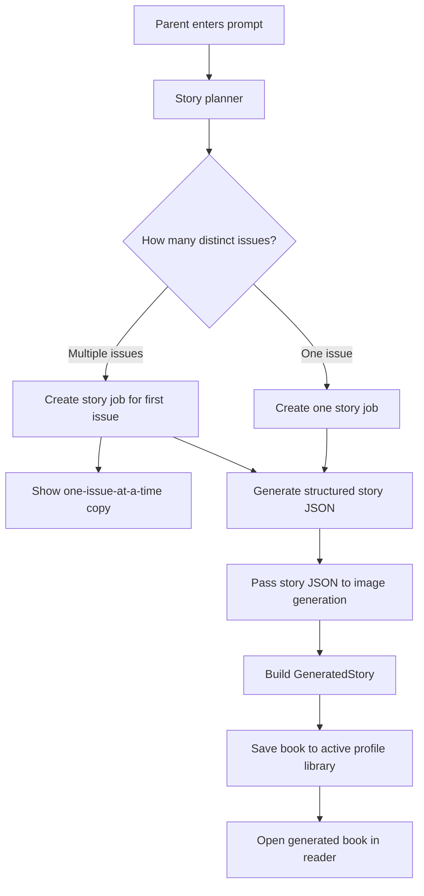

# Story Generation Spec

## Goal

Improve story generation so parents get focused, high-quality picture-book text from behavior prompts.

This spec covers:

- deterministic splitting of multi-issue prompts
- A-level story quality
- structured story JSON
- clear behavior when one prompt includes multiple behavior problems

Image generation requirements live in `docs/image-generation-spec.md`.

## Source Feedback

Key feedback:

- A prompt like `Meltdowns during transitions, Demanding screens constantly` contains two issues. The first issue should generate now; the UI should clearly say that one book is generated for one issue at a time.
- Current stories are useful but feel like B-/C+ stories.
- Target quality is A/A+, with A- as the minimum.

## Current Story Flow

1. Mobile sends a single `POST /api/stories/generate` request with `mode`, `prompt`, and selected character.
2. API starts one background story-sheet job and returns one `bookId`.
3. Job writes one structured story JSON.
4. Mobile polls one job until complete.
5. Mobile fetches one generated story, saves it to the active profile library, and opens the reader.

## Required Behavior

### 1. Deterministic Issue Splitting

When a parent prompt contains multiple distinct behavior issues, the system should generate only the first issue immediately. It should not create follow-up buttons or automatically queue the other issues.

Example:

```text
Meltdowns during transitions, Demanding screens constantly
```

Expected generation plan:

```json
{
  "issues": [
    {
      "issue": "Meltdowns during transitions",
      "bookIntent": "Help the child move from one activity to the next with a predictable bridge ritual."
    },
    {
      "issue": "Demanding screens constantly",
      "bookIntent": "Help the child tolerate screen limits and reconnect with non-screen comfort."
    }
  ]
}
```

The first issue should produce:

- story JSON
- generated story response
- saved library entry

Remaining issues should not be automatically generated. The parent can prompt again if they want another book.

Single-issue prompts should continue to produce one book.

### 2. Multi-Issue Copy

When more than one behavior issue is detected, show copy after starting the first story.

Suggested copy:

```text
We can generate one book for one issue at a time.
Generating this book for: Meltdowns during transitions.
```

Behavior:

- Use the first detected issue for the current story.
- Clearly name the issue being used for the current story.
- Do not show remaining-issue buttons.
- Do not automatically generate every issue in the original prompt.
- Let the parent prompt again if they want another story.

### 3. A-Level Story Quality

The story prompt should explicitly optimize for:

- emotional clarity
- story structure
- voice
- originality
- visual imagery
- child realism
- sentence rhythm
- memorability
- literary quality
- parent usefulness

The story should not read like instructions or therapy advice. The behavioral skill should appear through action, ritual, imagery, and repair.

Quality target:

- A/A+ desired
- A- minimum accepted

Story quality requirements:

- Use a concrete child-scale situation, not a generic moral.
- Give the child a believable emotional body response.
- Give the parent a useful but non-preachy intervention.
- Include one memorable object, phrase, image, or ritual that can anchor the story.
- Build a full arc: attachment to current state, rupture, co-regulation, small attempt, repair, return.
- Keep sentence rhythm suitable for read-aloud picture books.
- Avoid generic lines like "Liam learned it was okay" unless grounded in action.

### 4. Structured Story JSON

Each generated book should produce structured JSON with:

- title
- child name
- parent name and role
- normalized behavior
- 12 story pages
- each page's story text
- each page's visual scene
- each page's composition
- each page's emotion

The story text is the source of truth for the reader UI.

## Proposed Architecture



## Implementation Plan

### Phase 1: Story Planning Contract

Add a deterministic planning step before story generation.

Inputs:

- `mode`
- raw parent `prompt`
- selected character metadata

Output:

- normalized list of story issues
- one issue for single-issue prompts
- multiple issues for multi-issue prompts

For v1, use conservative splitting:

- split obvious comma-separated or newline-separated issue phrases
- trim and discard empty entries
- cap generated books per request, likely 3
- do not split short phrases that are clearly one combined idea

### Phase 2: Multi-Issue UX

Update generation so a single request:

- generates one book for the first detected issue
- returns the issue being used for the current book
- returns a short notice when more than one issue was detected

Preferred v1 behavior:

- API continues to start one normal story job
- the story job uses the first planned issue
- mobile saves and opens the generated book as it does today
- mobile shows copy explaining that one book can be generated for one issue at a time
- mobile names the issue being generated
- parent can prompt again if they want another story

### Phase 3: Story Prompt Upgrade

Revise `story-json-master-prompt.txt` to encode the A-level rubric.

Prompt changes should require:

- picture-book voice
- stronger scene specificity
- fresh metaphor or ritual
- real toddler/preschool emotional behavior
- parent usefulness through action, not explanation
- no lesson-summary ending unless earned by action

## Acceptance Criteria

### Multi-Issue Prompt

Given:

```text
Meltdowns during transitions, Demanding screens constantly
```

Expected:

- one book is generated immediately
- the generated book focuses only on transition meltdowns
- the book is saved in the active profile library
- the book does not appear in another profile's library
- the UI says one book can be generated for one issue at a time
- the UI names the first issue as the one being generated
- no remaining-issue buttons are shown

### Single-Issue Prompt

Given:

```text
Meltdowns during transitions
```

Expected:

- one book is generated
- story remains focused on transitions only
- no screen-demand storyline is introduced

### Story Quality

For `Meltdowns during transitions`, the generated story should meet A- or better in:

- emotional clarity
- story structure
- voice
- originality
- visual imagery
- child realism
- sentence rhythm
- memorability
- literary quality
- parent usefulness

## Open Questions

- Should each split issue preserve the original prompt as metadata for debugging?
